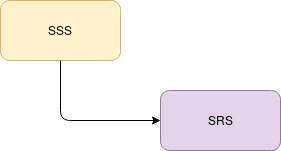
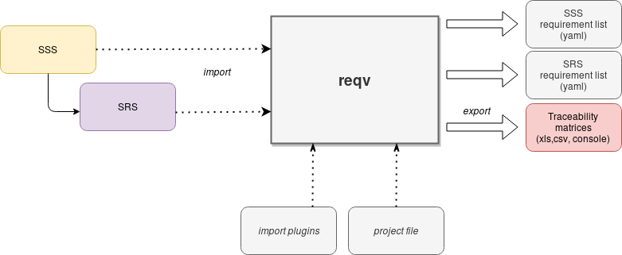

# requiremement verify - reqv

This tool is a help to create, verify traceability matrix.

In some project, especially the critical one, it is necessary to build some documentation.
This document must demonstration that the software is correctly declined from upper specficiations.

This tool help to do the traceability.

You given your upper document (directly in yaml format or imported from excel or docx format) and it 
will calculate if all your requirements are correctly declined.

Here we are a example to better understand.

Taken as hypothesis that your system team builds a document which describes the system and software behavior.
Call this document (SSS for System/Subsystem Specification).

You must produce a document declined from it as basis for software development, call this document SRS (Software 
Requirement Specification)

For each requirement that your write into your SRS you must ensure that it is relies to SSS requirement.

## How tool works ?

This tool works on intermediate data extracted for document. For example, documents are written with Excel or Word.

The tool will extract the requirement according to given rules and build a internal model on this.

Then you can request an export of the data, on the console to check in real time (when you write document) or
to generate the traceability matrix

Here we are a schema with involved files.

## Example:

The *Tests* folder contains a lot of examples. 

